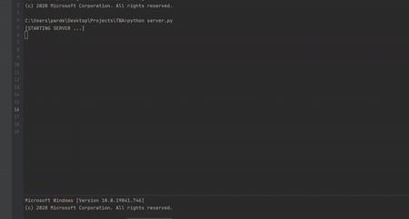

# Summary

This directory contains a WebSocket client/server architecture for identifying arbitrage opportunities in a simulated exchange environment.
Markets tend to have different prices for a certain asset at a given timestamp, this algorithm takes advantage of this price discrepancy by
identifying opportunities to capitalize.

From the project directory, simply run server.py followed by client.py

